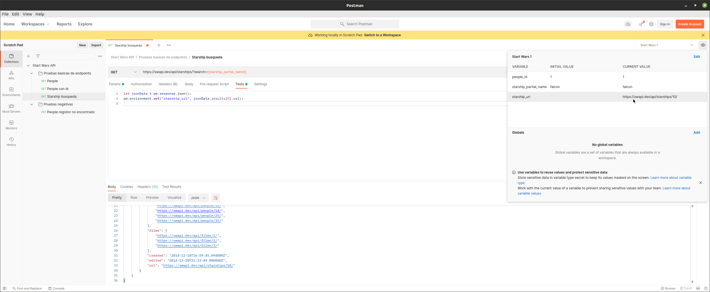

# Ejemplo 3 - Postman

## :dart: Objetivos

- Identificar las funcionalidades principales de Postman
- Utilizar Postman para crear pruebas del API
- Crear colecciones en Postman

## ⚙ Requisitos

- Postman
- Node.js

## Desarrollo

### Colecciones

Antes de comenzar a trabajar con Postman crearemos una colección para agrupar nuestras solicitudes (requests).

Las solicitudes de una colección se pueden agrupar en carpetas para facilitar la organización. Incluso es posible tener
carpetas anidadas. Así que primero, vamos a crear una colección. Si aún no está en la pestaña Colección, asegúrate de
hacer clic en esa pestaña Colecciones.


Luego haz clic en el botón Nueva colección. Vamos a nombrar nuestra colección, Start Wars API, y luego haremos clic en
el botón Crear.


Podemos ver que ahora tenemos nuestra colección lista y ahora podemos agregar algunas carpetas. Vamos a crear dos
carpetas, una para pruebas básicas de endpoints y otra para pruebas negativas. Entonces, para agregar una carpeta, vamos
a hacer clic en los tres puntos. Luego vamos a hacer clic en Agregar carpeta.


Vamos a nombrar nuestra primera carpeta, Pruebas básicas de endpoint, y haremos clic en el botón Crear. Ahora, si
abrimos nuestra nueva colección, podemos ver que ahora tenemos una carpeta Pruebas básicas de endpoint. Ahora agreguemos
la carpeta de pruebas negativas. Haz clic en los tres puntos en la colección, haga clic en Agregar carpeta. Vamos a
nombrar esta carpeta Pruebas negativas y haremos clic en el botón Crear. Ahora tenemos una colección y un par de
carpetas en las que guardar nuestras pruebas. A continuación, comenzaremos a agregar algunas solicitudes a la carpeta
Pruebas básicas de endpoints.


### GET Request

La API con la que estaremos trabajando es: `https://swapi.dev/api/`

Para añadir una petición GET a nuestra colección, nos dirigimos al folder _Pruebas basicas de endpoints_ y damos clic
en _añadir petición_. La nombraremos people y en URL ingresaremos: `https://swapi.dev/api/people/`. Damos clic en enviar
y deberíamos obtener la información.


### Peticiones negativas

Cuando las peticiones dan como resultado una respuesta positiva, obtenemos un código de respuesta de nivel 200 porque
nuestras solicitudes se formaron correctamente. Pero también es importante poder probar qué sucede cuando una solicitud
no se forma correctamente para asegurarse de que la API responda adecuadamente.

Podemos crear solicitudes que se pueden usar para probar cinco escenarios negativos diferentes.

- No se encuentra un registro.
- Se envía una solicitud con información requerida faltante.
- Se envía un valor con demasiados caracteres.
- Se envía un valor con caracteres no válidos.
- Se envía un valor que no está en el formato correcto.

Primero, comenzaremos con las peticiones que darán como resultado un error de no encontrado. Guardaremos nuestras
peticiones en la carpeta de pruebas negativas.

Realizaremos una petición al endpoint `https://swapi.dev/api/people/{id}` usando como id a un valor que sabemos que
nunca será válido, por ejemplo un string.


### Variables de entorno

Hasta el momento hemos realizado un par de peticiones con datos, como el ID, ingresados directamente. Sin embargo en
algún momento queremos cambiar esta información hacerlo sería tedioso. Podemos ahorrar mucho tiempo usando variables en
lugar de valores codificados.

A continuación aprenderemos a crear un entorno, que es un grupo de variables. Entonces, para crear un entorno, hacemos
clic en el ícono del ojito en la parte superior derecha de la pantalla.


Luego hacemos clic en el botón Agregar. Démosle un nombre a nuestro entorno. Simplemente lo llamaremos _Star Wars 1_.
Luego hacemos clic en el botón Agregar para guardar. Podemos ver que nuestro entorno ha sido añadido.


Hagamos clic en el entorno para agregar algunas variables. Echa un vistazo a la tabla de variables. Verás que una
variable puede tener un valor inicial y un valor actual. El valor inicial es lo que se guarda en el archivo de entorno.
El valor actual se utiliza cuando desea cambiar temporalmente una variable. Ahora agreguemos las variables. Añadiremos
people_id. Y podemos hacer clic en Actualizar para guardar. Y luego podemos cerrar la ventana de entorno.


Ahora vamos a elegir usar nuestro entorno, y lo hacemos seleccionándolo del menú desplegable. Así que ahora usaremos el
entorno de _Star Wars 1_. Ahora usemos las variables que agregamos. Así que agreguemos una nueva solicitud llamada _
People con id_. Vamos a la URL de la petición e ingresamos: `https://swapi.dev/api/people/{{people_id}}`
Usamos dos corchetes para encerrar nuestros nombres de variables. Es importante tener en cuenta que las variables de
Postman distinguen entre mayúsculas y minúsculas. Así que tenemos que asegurarnos de usar la misma distinción entre
mayúsculas y minúsculas que usamos cuando creamos las variables. Cuando Postman ve las dos llaves, sabe usar el valor de
la variable que se encuentra en el entorno. Vamos a probarlo. Guardaremos nuestra solicitud y ahora hagamos clic en
Enviar. Y podemos ver que Postman reemplazó {{people_id}} con `1`.


### Guardar respuesta como variable

En la sección anterior, aprendimos cómo crear variables de entorno y usarlas en nuestras solicitudes. Pero, ¿y si aún no
sabemos cuál es el valor de nuestra variable? Podemos usar JavaScript en la sección de prueba de nuestras solicitudes
para guardar un valor que se devolvió de la solicitud. A continuación, aprenderemos cómo guardar el ID de contacto que
se devuelve de nuestra solicitud de agregar contacto como una variable. Y luego, usaremos esa variable en solicitudes
posteriores.

Vamos a crear una nueva petición llamada Starship búsqueda.


Ahora vamos a hacer clic en la pestaña de prueba. Cuando hacemos clic en la pestaña de pruebas, verá que aparecen
algunos fragmentos de código en el lado derecho de la ventana. Estos fragmentos se pueden usar para crear comandos de
JavaScript. Son realmente útiles para aquellos de nosotros que a menudo olvidamos la sintaxis del código. Así que vamos
a buscar establecer una variable de entorno y hacer clic en eso y podemos ver que ese texto se agregó automáticamente a
nuestras pruebas. Y hay dos valores que se pasan al comando pm environment set. La primera es el nombre variable y el
valor la variable. Vamos a cambiarle el nombre a starship_url.

```javascript
let jsonData = pm.response.json();
pm.environment.set("starship_url", jsonData.results[0].url);
```


Antes de establecer el valor de la variable, debemos analizar los datos de respuesta que vamos a obtener como json..
Esto está creando una nueva variable local llamada `jsonData` y tomará la respuesta de postman que recibimos cuando
agregamos una nave, analizaremos esos datos como json y los guardaremos en `jsonData`. Entonces, ahora que lo hemos
hecho, podemos referirnos a los datos json en la siguiente línea. Así que vamos a reemplazar el valor de la variable
con `jsonData.results[0].url`

Veamos si la url de la nave se guardó en nuestro archivo de entorno. Vamos a hacer clic en el globo ocular. Esto es para
la vista rápida del entorno y podemos ver que ahora tenemos una nueva variable `starship_url` y que el valor que
devolvió nuestra solicitud se ha establecido como el valor de la misma. Ahora, podemos usar esta variable en nuestras
otras solicitudes.



Ahora crearemos una nueva solicitud para obtener una nave, utilizando nuestra nueva variable


