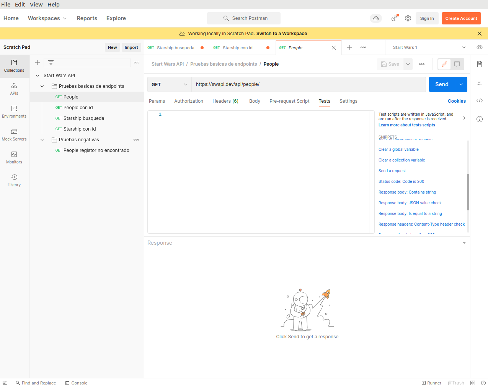
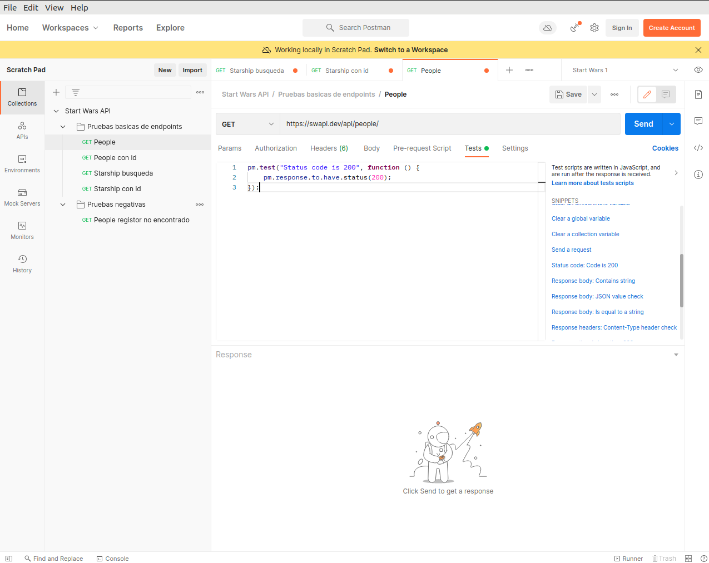
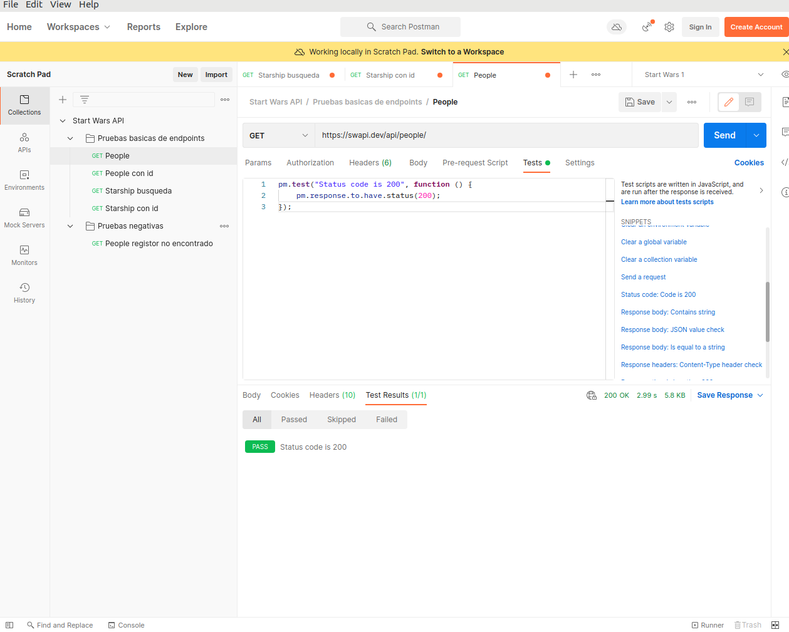
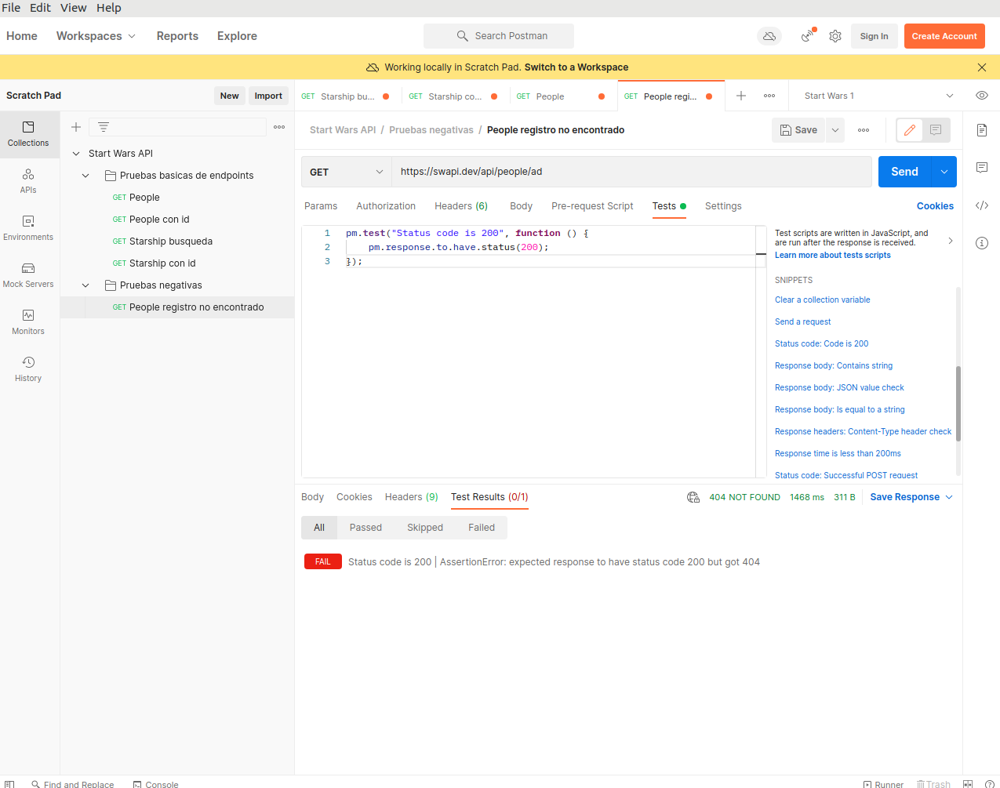
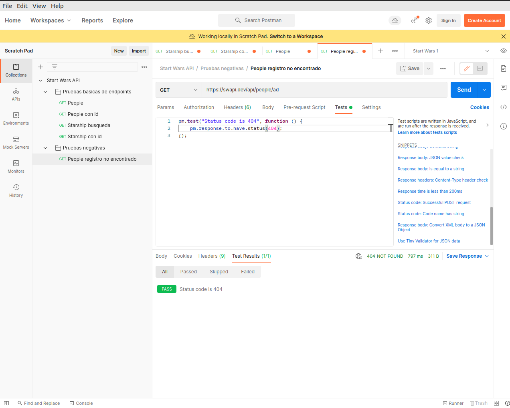

# Ejemplo 4 - Postman: testing

## :dart: Objetivos

- Identificar las funcionalidades principales de Postman
- Utilizar Postman para crear pruebas del API
- Crear colecciones en Postman

## ⚙ Requisitos

- Postman
- Node.js

## Desarrollo

### Aserciones de tipo de estado

Ahora es el momento de convertir nuestras solicitudes de Postman en pruebas reales. Haremos esto agregando scripts de
aserción a nuestras solicitudes. El primer tipo de aserción que agregaremos es una aserción de tipo de estado, que
válida que el código de estado que recibimos como respuesta a una solicitud es el que estamos esperando.

Agreguemos una afirmación de tipo de estado a nuestra solicitud de People. Así que elegiremos obtener la lista de
personas. Luego elegiremos la pestaña de pruebas. Y vemos nuestros fragmentos aquí a la derecha. Desplácese hacia abajo
hasta que encontremos el código de estado, el código es 200, y haga clic en eso.

Echemos un vistazo a esta afirmación. Entonces, la parte en azul aquí es el nombre de la prueba. Y esta sección aquí es
la afirmación misma. Si está familiarizado con la sintaxis de Chai, Postman usa la sintaxis de Chai para la aserción.
Así que guardemos esta afirmación y la enviaremos.

Y podemos ver aquí abajo que uno de nuestros tests pasó. Y si hacemos clic en ese número, podemos ver el ícono de pasar
y el nombre de nuestra prueba que pasó.

Ahora agreguemos una aserción de tipo de estado a una solicitud negativa. Así que hagamos clic en la solicitud de
obtener persona registro no encontrado. E iremos a la pestaña de pruebas. Y elegiremos, una vez más, el código de
estado, el código es 200 para nuestro fragmento. Ahora, sabemos que esta solicitud no devolverá una respuesta 200, sino
una respuesta 404 porque no se encuentra a la persona. Pero para ver cómo se ve una falla en la prueba, hagamos clic en
el botón Enviar y podemos ver que pasaron cero pruebas. Y si hacemos clic allí, podemos ver el ícono de error, y aquí
está el nombre de nuestra prueba. Y entonces podemos ver nuestro error de aserción. Se esperaba que la respuesta tuviera
el código de estado 200, pero obtuvo 404.

Ahora cambiemos nuestra afirmación para que realmente pase. Así que le cambiaremos el nombre porque queremos que el
nombre de nuestra prueba sea el código de estado 404, y luego cambiaremos el código de estado que realmente estamos
esperando. Guardemos eso y lo enviamos. Y ahora podemos ver que nuestra prueba pasó y nuestro código de estado es
404 y la prueba con un ícono de aprobación. Las aserciones de tipo de estado son el tipo de aserción más simple. Puedes
usarlos para cualquier tipo de código de estado.

